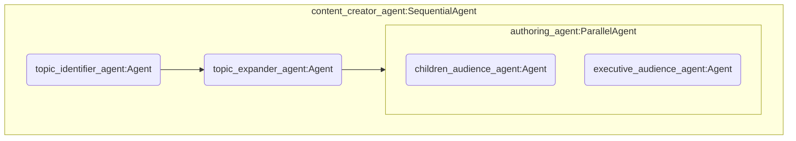
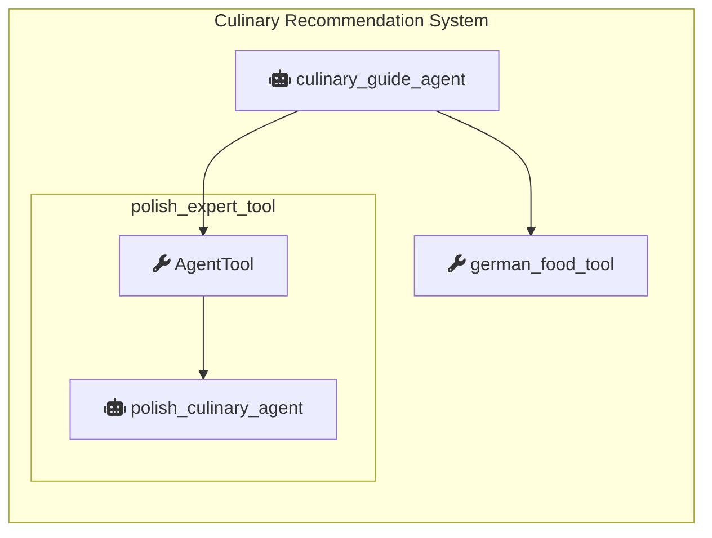

# Eskadra Bielik - Misja 1 - ADK + Cloud Run + Bielik
Przykładowy kod źródłowy pozwalający na:

* Skonfigurowanie własnej instancji modelu [Bielik](https://ollama.com/SpeakLeash/bielik-4.5b-v3.0-instruct) w oparciu o [Ollama](https://ollama.com/)

* Skonfigurowanie prostych systemów agentowych przy wykorzystaniu [Agent Development Kit](https://google.github.io/adk-docs/)

* Uruchomienie obu powyższych serwisów na [Cloud Run](https://cloud.google.com/run?hl=en)


## 1. Przygotowanie projektu Google Cloud Platform

### Uzyskaj kredyt Cloud **OnRamp** i skonfiguruj płatności w projekcie Google Cloud Platform

  > [!NOTE]
  > Nie potrzebujesz karty kredytowej ani płatności — otrzymasz 10 dolarów darmowych środków. Zajmie Ci to mniej niż 2 minuty, wystarczy wpisać swoje imię i nazwisko oraz zaakceptować środki.
   
  <details>
  
  <summary>Krok 1: Włącz konto billingowe, dzięki uzyskanym środkom</summary>
      
  1. Załóż konto rozliczeniowe z 10 dolarami kredytu, który będzie potrzebny do wdrożenia. Upewnij się, że masz konto Gmail.
  
  - Kliknij w przycisk: <ins>Zaloguj się jako...</ins>

    

  2 Wybierz konto z domeny @gmail.com i naciśnij przycisk: <ins>Dalej</ins>

   

  3 Po poprawnym zalogowaniu pojawi się Twoje konto z domeny @gmail.com, naciśnij przycisk: <ins>Click here to access your credits</ins>

   

  4 Otworzy się nowa zakładka w przeglądarce

  - Zweryfikuj uzupełnione pola: Imię, Nazwisko
    
  - W polu: _Adres e-mail konta_ pojawi się adres Twojego konta w domenie @gmail.com
    
  - Pole: **Kod kuponu - PROSZĘ NIE EDYTOWAĆ !** 
    
  - Naciśnij przycisk: <ins>Zaakceptuj i kontynuuj</ins>

    

  5 W polu **Konto rozliczeniowe** pojawi się informacja o treści **Google Cloud Platform Trial Billing...** oznacza to, że środki zostały aktywowane na Twoim koncie @gmail.com oraz konto bilingowe zostało poprawnie aktywowane bez konieczności podawania karty kredytowej - masz środki na dalszą część warsztatu.

   

  6 Zmieńmy nazwę na bardziej przyjazną, wybierz pozycję: _Zarządzanie kontem_

   

  7 Kliknij w ikonkę: _Edycji_  pojawi się okno z informacją: _Zmień nazwę konta rozliczeniowego_ w polu *Nazwa* podaj:

  ```
  eskadra-bielik-misja1
  ```
  
  - Naciśnij przycisk: <ins>Zmień nazwę</ins>

    

  8 W polu *Konto rozliczeniowe* nowa nazwa została poprawnie zmieniona. 

   

  9 W celu weryfikacji przyznanych środków wybierz pozycje: _Środki_ i zobacz w tabeli przyznane środki kolumnę o tytule **Stan**, która wskazuje na **Dostępny**. 

   

  10 Gratulacje, możesz przejść do następnego kroku warsztatu.

  </details>

  <details>
  
  <summary>Krok 2: Stwórz nowy projekt Google Cloud Platform i powiąż z utworzonym kontem biligowym</summary>

  1 Powróć na główny ekran Google Cloud Platform.
  
  - Kliknij w logo: <ins>Google Cloud</ins>
  
  - Kliknij w pozycję z napisem: <ins>Wybierz projekt</ins>

      

  2 Po wybraniu pojawi się okienko z informacją o projektach

  - Kliknij w przycisk: <ins>Nowy projekt</ins>
  
    

  3 Pojawi się formularz z informacją o nowym projekcie, gdzie nadamy własną nazwę projektu

   

  4 W pozycji: _Nazwa projektu_ podajemy naszą własną nazwę:
  
  ```
  eskadra-bielik
  ```

  - Klikamy przycisk: <ins>Utwórz</ins>

    

  5 Pojawi się informacja o utworzeniu projektu

   

  6 W celu weryfikacji czy utworzone konto zostało powiązane z kontem bilinowym, na którym mamy uzyskane środki kredytowe
    
  - Z lewego menu wybierz pozycję: <ins>Płatności</ins>

    

  7 Pojawiła się informacja o Twoich kontach rozliczeniowych
  
  - Kilknij w zakładkę: <ins>Twoje projekty</ins>

    

  8 Jeżeli w pozycji *Konto rozliczeniowe* widzisz nazwę **eskadra-bielik-misja1**, to oznacza, że wszystkie kroki wcześniejsze zostały wykonane poprawnie

   

  9 Powróć na główny ekran Google Cloud Platform.
  
  - Kliknij w logo: <ins>Google Cloud</ins>
  - Kliknij w pozycję z napisem: <ins>Wybierz projekt</ins>

    

  10 Wybierz z listy projekt o nazwie: <ins>eskadra-bielik</ins>

   

  11 Wracamy na główną stronę tym razem mamy już uzupełnione informacje na jakim projekcie pracujemy
  
  - Zobacz w opisie: _Pracujesz w:_ jest informacja, że pracujemy na projkcie: <ins>eskadra-bielik</ins>
  
  - W _Numer projektu_ i _Identyfiaktor projektu_ znajdują się Twoje uniklane dane, gdzie pomoc Google Cloud Platform w tej sposób identyfikuje Twój projekt

    

  12 Gratulacje, możesz przejść do następnego kroku warsztatu.

  </details>

  <details>
  
  <summary>Krok 3: Otwórz terminal Cloud Shell ([dokumentacja](https://cloud.google.com/shell/docs))</summary>

  1 Na górnym pasku Google Cloud Platform.
  
  - Kliknij w ikonkę terminala CLI: 

      

  2 Po uruchomieniu terminala:
  
  - Kliknij w przycisk: <ins>Autoryzuj</ins>

    

  3 Terminal CLI poprawnie uruchomiony

  

  </details>

  <details>
  
  <summary>Krok 4: Sklonuj repozytorium z przykładowym kodem i przejdź do nowo utworzonego katalogu</summary>

  1 Skopiuj przygotowane komendy do terminala CLI i naciśnij na klawaiturze klawisz ENTER

  ```bash
   git clone https://github.com/avedave/eskadra-bielik-misja1
   cd eskadra-bielik-misja1
  ```

  - Wynik poprawnie wykonanego kroku (repozytorium cały czas żyje, więc wartości mogą być prezentowane inne):
    

  </details>
  
  <details>
  
  <summary>Krok 5: Zmień nazwę pliku `.env.sample` na `.env`</summary>

  1 Skopiuj przygotowane komendy do terminala CLI i naciśnij na klawaiturze klawisz ENTER

   ```bash
   mv .env.sample .env
   ```

  </details>

7. Zaktualizuj odpowiednie na tym etapie zmienne środowiskowe w pliku `.env`     
      * `BIELIK_EVENT_ID`- Identyfikator warsztatów zgodny z kodem użytym w OnRamp Credits
      * `GOOGLE_CLOUD_LOCATION`- zmienną definiującą region Google Cloud
      * `BIELIK_SERVICE_NAME` - domyślną nazwę dla usługi gdzie uruchomimy Bielika
      * `BIELIK_MODEL_NAME` - wersję Bielika z której będziemy korzystać 

>[!TIP]
>W terminalu `Cloud Shell` dostępny jest edytor po wybraniu opcji *Open Editor*

   ```bash
   BIELIK_EVENT_ID="<IDENTYFIKATOR>"
   GOOGLE_CLOUD_LOCATION="europe-west1"  # Europe (Belgium)
   BIELIK_SERVICE_NAME="ollama-bielik-v3"
   BIELIK_MODEL_NAME="SpeakLeash/bielik-4.5b-v3.0-instruct:Q8_0"
   ```
>[!IMPORTANT]
>Jeżeli zmieniasz w `BIELIK_MODEL_NAME` domyślny model Bielika na inną wersję, to zaktualizuj tę informację również w pliku `ollama-bielik/Dockerfile`

   ```dockerfile
   ENV MODEL SpeakLeash/bielik-4.5b-v3.0-instruct:Q8_0
   ```

8. Wczytaj zmienne środowiskowe korzystając z podręcznego skryptu

   ```bash
   source reload-env.sh
   ```


## 2. Własna instancja Bielika

1. Ustal domyślne konto serwisowe dla wybranego projektu `default service account`
   ```bash
   gcloud builds get-default-service-account
   ```

2. Poniższa komenda stworzy nową usługę w Cloud Run o nazwie takiej jak wartość zmiennej `$BIELIK_SERVICE_NAME`. Na podstawie definicji w `ollama-bielik/Dockerfile` nardzędzie `gcloud` stworzy odpowiedni kontener, skonfiguruje usługę Ollama oraz wczyta odpowiednią wersję modelu Bielik.

   ```bash
   gcloud run deploy $BIELIK_SERVICE_NAME --source ollama-bielik/ --region $GOOGLE_CLOUD_LOCATION --concurrency 7 --cpu 8 --set-env-vars OLLAMA_NUM_PARALLEL=4 --gpu 1 --gpu-type nvidia-l4 --max-instances 1 --memory 16Gi --allow-unauthenticated --no-cpu-throttling --no-gpu-zonal-redundancy --timeout 600 --labels dev-tutorial=codelab-dos-$BIELIK_EVENT_ID
   ```

>[!CAUTION]
>Flaga `--allow-unauthenticated` udostępnia usługę publicznie w internecie i każdy kto zna URL, może zaczać z niej korzystać. W środowisku produkcyjnym zazwyczaj trzeba tę flagę usunąć i odpowiednio skonfigurować reguły dostępu.

3. Uruchom poniższą komendę, aby sprawdzić pod jakim URL jest dostępny Bielik

   ```bash
   gcloud run services describe $BIELIK_SERVICE_NAME --region=$GOOGLE_CLOUD_LOCATION --format='value(status.url)'
   ```
>[!TIP]
>Odpowiedz twierdząco, jeżeli system spyta o włączenie odpowiednich API oraz stworzenie rejestru artefaktów

4. Przypisz powyższy URL do zmiennej środowiskowej `OLLAMA_API_BASE` w pliku `.env` i następnie wczytaj zmienne środowiskowe ponownie:
   ```bash
   source reload-env.sh
   ```


### Jak sprawdzić, czy nasz Bielik jest gotowy?

* Sprawdź w Google Cloud console czy nowy serwis jest już dostępny
* Sprawdź czy otwierając URL w przeglądarce zobaczysz informację: `Ollama is running`
* Sprawdź przez API jakie modele są dostępne lokalnie na serwerze Ollama
   ```bash
   curl "${OLLAMA_API_BASE}/api/tags"
   ```
* Wyślij zapytanie przez API
   ```bash
   curl "${OLLAMA_API_BASE}/api/generate" -d "{
      \"model\": \"$BIELIK_MODEL_NAME\",
      \"prompt\": \"Kto zabił smoka wawelskiego?\",
      \"stream\": false
   }"
   ```


## 3. Konfiguracja systemów agentowych ADK

1. Skonfiguruj swój własny klucz Gemini API
   *   Stwórz lub skopiuj istniejący Gemini API key z [Google AI Studio](https://ai.dev).
   *   Dodaj wartość klucza ze swojego Gemini API key jako wartość zmiennej `GOOGLE_API_KEY` w pliku `.env`
   ```bash
   GOOGLE_API_KEY=TWÓJ_KLUCZ
   ```
2. Wczytaj zmienne środowiskowe ponownie
   ```bash
   source reload-env.sh
   ```
3. Przejdź do katalogu z agentami

   ```bash
   cd adk-agents
   ```
   
4. Stwórz i aktywuj wirtualne środowisko Python

   ```bash
   python -m venv .venv
   source .venv/bin/activate
   ```
   
5. Zainstaluj wymagane komponenty

   ```bash
   pip install -r requirements.txt
   ```


## 4. Przykładowe systemy agentowe

### 4.1 System agentowy - Twórca treści (`content_creator`)

Ten prosty system agentowy, działający jedynie w oparciu o model Bielik, jest prostym przykładem wykorzystania [LLM Agents](https://google.github.io/adk-docs/agents/llm-agents/) oraz [Workflow Agents](https://google.github.io/adk-docs/agents/workflow-agents/) dostępnych w ADK. System ma na celu generowanie artykułów dla różnych grup docelowych (dzieci, kadra zarządzająca) w oparciu o temat zasugerowany przez użytkownika.

- `content_creator_agent` - Główny, sekwencyjny agent, uruchamia pod-agentów jeden po drugim
- `topic_identifier_agent` - Agent LLM odpowiedzialny za zidentyfikowanie tematu którym interesuje się użytkownik.
- `topic_expander_agent` - Agent LLM odpowiedzialny za rozwinięcie tematu. Generuje listę ciekawych faktów związanych z tematem.
- `authoring_agent` - Agent równoległy - uruchamia pod-agentów równolegle. Zawiera dwóch pod-agentów, po jednym na każdą grupę docelową
- `children_audience_agent` - Agent LLM odpowiedzialny za tworzenie treści skierowanych do dzieci.
- `executive_audience_agent` - Agent LLM odpowiedzialny za tworzenie treści skierowanych do kadry zarządzającej.




1. Upewnij się, że jesteś w katalogu `adk_agents` oraz że wszystkie zmienne środowiskowe są załadowane
2. Uruchom agenta w konsoli **Cloud Shell** i rozpocznij interakcję

   ```bash
    adk run content_creator/
   ```


### 4.2 System agentowy - Przewodnik kulinarny (`culinary_guide`)

Ten hybrydowy system agentowy, działający w oparciu o modele Gemini i Bielik, jest przykładem wykorzystania Agentów LLM ([LLM Agents](https://google.github.io/adk-docs/agents/llm-agents/)), funkcji-jako-narzędzi ([Function Tools](https://google.github.io/adk-docs/tools/function-tools/#function-tool)) oraz agentów-jako-narzędzi ([Agent-as-a-tTool](https://google.github.io/adk-docs/tools/function-tools/#agent-tool)) dostępnych w ADK.

System ma na celu pełnienie roli międzynarodowego przewodnika kulinarnego, który deleguje zadania do wyspecjalizowanych pod-agentów lub narzędzi w zależności od kraju, o który pyta użytkownik.

- `culinary_guide_agent` - Główny agent, który komunikuje się z użytkownikiem w języku angielskim. Jego zadaniem jest zrozumienie prośby o rekomendacje kulinarne, identyfikacja kraju i preferencji dietetycznych, a następnie delegowanie zadania do odpowiednich narzędzi.
- `polish_expert_tool` - Narzędzie typu AgentTool, które opakowuje agenta polish_culinary_expert_agent, umożliwiając głównemu agentowi korzystanie z jego wyspecjalizowanych zdolności.
- `polish_culinary_expert_agent` - Wyspecjalizowany Agent LLM oparty na modelu Bielik, ekspert w dziedzinie kuchni polskiej. Przyjmuje zapytania i odpowiada wyłącznie w języku polskim.
- `german_food_tool` - Proste narzędzie oparte na funkcji Pythona, które dostarcza rekomendacji kulinarnych dla Niemiec w oparciu o zdefiniowaną logikę.


1. Upewnij się, że jesteś w katalogu `adk_agents` oraz że wszystkie zmienne środowiskowe są załadowane
2. Uruchom agenta w konsoli **Cloud Shell** i rozpocznij interakcję

   ```bash
    adk run culinary_guide_agent/
   ```


## 5. Przetestuj systemy agentowe w środowisku Cloud Shell + Web

1. Upewnij się, że jesteś w katalogu `adk_agents` oraz że wszystkie zmienne środowiskowe są załadowane
2. Uruchom środowisko ADK Web
    ```bash
    adk web
    ```
3. Zmień port w **Web View** (jeżeli potrzeba, zazwyczaj jest to port 8000)
4. Zaakceptuj zmiany poprzez: *Change and Preview*
5. Z rozwijanego menu po lewej stronie ekranu wybierz system z którym chcesz pracować


## 6. Uruchom systemy agentowe w Cloud Run

1. Upewnij się, że jesteś w katalogu `adk_agents` oraz że wszystkie zmienne środowiskowe są załadowane
    ```bash
    gcloud run deploy adk-agents --source . --region $GOOGLE_CLOUD_LOCATION --allow-unauthenticated --set-env-vars GOOGLE_CLOUD_LOCATION=$GOOGLE_CLOUD_LOCATION --set-env-vars OLLAMA_API_BASE=$OLLAMA_API_BASE --set-env-vars GOOGLE_API_KEY=$GOOGLE_API_KEY --labels dev-tutorial=codelab-dos-$BIELIK_EVENT_ID
    ```
>[!CAUTION]
>Flaga `--allow-unauthenticated` udostępnia usługę publicznie w internecie i każdy kto zna URL, może zaczać z niej korzystać. W środowisku produkcyjnym zazwyczaj trzeba tę flagę usunąć i odpowiednio skonfigurować reguły dostępu.

2. Narzędzie `gcloud` stworzy kontener na podstawie konfiguracji zawartej w `adk-agents/Dockerfile` i uruchomi usługę w Cloud Run, podając URL pod którym serwis będzie dostępny
3. Wywołaj otrzymany URL w przeglądarce WWW aby mieć dostęp do środowiska ADK Web
